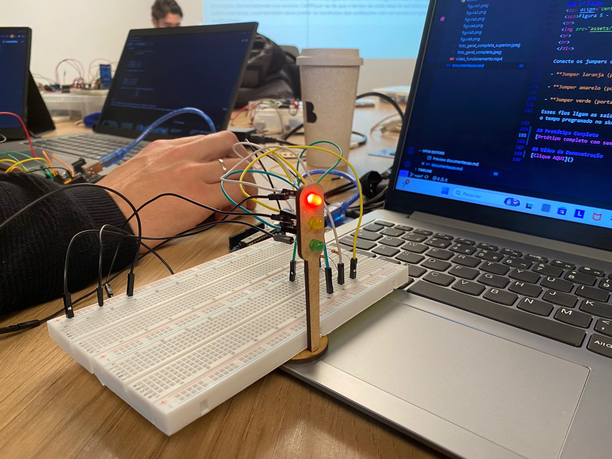

# Semáforo com Arduino

## Descrição do Projeto
Este projeto tem como objetivo criar um **sistema de semáforo automatizado** utilizando **Arduino UNO**, **LEDs** e **resistores**, simulando o funcionamento de um cruzamento real.  
O sistema alterna automaticamente entre as três fases do semáforo, garantindo a segurança de pedestres e veículos:

- 🔴 **Vermelho:** 6 segundos  
- 🟢 **Verde:** 4 segundos  
- 🟡 **Amarelo:** 2 segundos  

---

## Componentes Utilizados

| Componente | Quantidade | Especificação / Observação |
|-------------|-------------|-----------------------------|
| LED vermelho | 1 | Representa o sinal de **Pare** |
| LED amarelo | 1 | Representa o sinal de **Atenção** |
| LED verde | 1 | Representa o sinal de **Siga** |
| Resistores | 3 | 220 Ω — um para cada LED |
| Protoboard | 1 | Padrão 830 pontos |
| Fios jumper | 5 | Macho–macho |
| Fios jumper | 4 | Macho–fêmea |
| Arduino UNO | 1 | Microcontrolador principal |
| Cabo USB | 1 | Alimentação e upload do código |

---

## Esquema de Ligação

### Conexões dos LEDs
| LED | Pino Arduino | Ligação |
|------|----------------|----------|
| Vermelho | + resistor → 8 | GND |
| Amarelo | + resistor → 9 | GND |
| Verde | + resistor → 10 | GND |

---

## Código Fonte (Arduino IDE)

```cpp
// Classe que representa um semáforo com 3 LEDs
class Semaforo {
  private:
    int pinoVermelho;
    int pinoAmarelo;
    int pinoVerde;

  public:
    // Construtor
    Semaforo(int vermelho, int amarelo, int verde) {
      pinoVermelho = vermelho;
      pinoAmarelo = amarelo;
      pinoVerde = verde;
    }

    // Inicializa os pinos
    void iniciar() {
      pinMode(pinoVermelho, OUTPUT);
      pinMode(pinoAmarelo, OUTPUT);
      pinMode(pinoVerde, OUTPUT);
    }

    // Métodos para as fases do semáforo
    void vermelho(int tempo) {
      digitalWrite(pinoVermelho, HIGH);
      digitalWrite(pinoAmarelo, LOW);
      digitalWrite(pinoVerde, LOW);
      delay(tempo);
    }

    void verde(int tempo) {
      digitalWrite(pinoVermelho, LOW);
      digitalWrite(pinoAmarelo, LOW);
      digitalWrite(pinoVerde, HIGH);
      delay(tempo);
    }

    void amarelo(int tempo) {
      digitalWrite(pinoVermelho, LOW);
      digitalWrite(pinoAmarelo, HIGH);
      digitalWrite(pinoVerde, LOW);
      delay(tempo);
    }
};

// Criação de um ponteiro para objeto Semaforo
Semaforo* semaforo;

void setup() {
  // Instancia o objeto dinamicamente (na memória heap)
  semaforo = new Semaforo(8, 9, 10);
  semaforo->iniciar(); // Usa '->' porque é um ponteiro
}

void loop() {
  semaforo->vermelho(6000);
  semaforo->verde(4000);
  semaforo->amarelo(2000);
}
```

## Tutorial de Montagem

### 1° Passo - Conexão Inicial
<div align="center">
<sub>Figura 1 - Requisitos iniciais</sub>
<br>

<br>
<br>
</div>

Neste primeiro momento, reúna os materiais principais: uma protoboard, um Arduino UNO e um cabo USB.

Conecte o Arduino ao computador usando o cabo USB, que servirá tanto para alimentar o circuito quanto para enviar o código a partir da IDE Arduino.

A protoboard será utilizada como base para todas as conexões, permitindo montar o circuito sem soldas.

### 2° Passo - Alimentação da Protoboard
<div align="center">
<sub>Figura 2 - Primeiras ligações</sub>
<br>

<br>
<br>
</div>

Conecte o pino 5V do Arduino à coluna positiva (+) da protoboard utilizando um jumper vermelho e essa coluna distribuirá a tensão positiva para os componentes.

Depois, ligue o pino GND do Arduino à coluna negativa (–) da protoboard com um jumper preto, criando o caminho de retorno da corrente elétrica.

Essas duas colunas (5V e GND) funcionarão como “barramentos de energia” do seu circuito.

### 3° Passo
<div align="center">
<sub>Figura 3 - Implantação dos LEDs</sub>
<br>

<br>
<br>
</div>

Serão utilizados três LEDs: vermelho, amarelo e verde, representando as fases do semáforo.
Coloque cada LED em linhas separadas da protoboard, respeitando a polaridade:
- **A perna menor (catodo) de cada LED deve estar ligada na coluna GND (linha negativa).**
- A perna maior (anodo) ficará livre, pois será conectada a um resistor no próximo passo.
Mantenha os LEDs organizados na ordem: vermelho, amarelo e verde, para facilitar a visualização da sequência.

### 4° Passo
<div align="center">
<sub>Figura 4 - Implantação dos resistores</sub>
<br>

<br>
<br>
</div>

Adicione três resistores de 330 Ω, um para cada LED.

**Cada resistor deve ser conectado entre a perna maior (anodo)** do LED e uma linha livre da protoboard, onde depois será ligado o fio de controle do Arduino.
Esses resistores são essenciais para limitar a corrente que passa pelos LEDs, evitando que queimem ao serem energizados.

### 5° Passo
<div align="center">
<sub>Figura 5 - Implantação dos jumpers</sub>
<br>

<br>
<br>
</div>

Conecte os jumpers de sinal, que vão controlar o acendimento dos LEDs:

- **Jumper laranja (porta 8)**: conectar na linha do resistor do LED vermelho.

- **Jumper amarelo (porta 9)**: conectar na linha do resistor do LED amarelo.

- **Jumper verde (porta 10)**: conectar na linha do resistor do LED verde.

Esses fios ligam as saídas digitais do Arduino aos LEDs, permitindo que o código acione cada cor conforme o tempo programado no sketch.

## Protótipo Completo


## Vídeo de Demonstração
[Clique AQUI](https://drive.google.com/file/d/1FtbjozhcOKHAtU4wLIaT06EE87sjUokb/view?usp=sharing)
