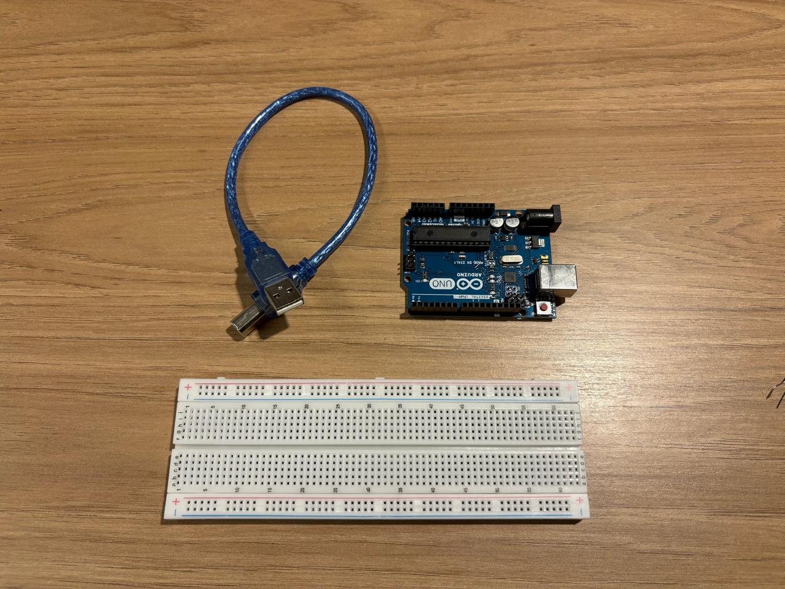
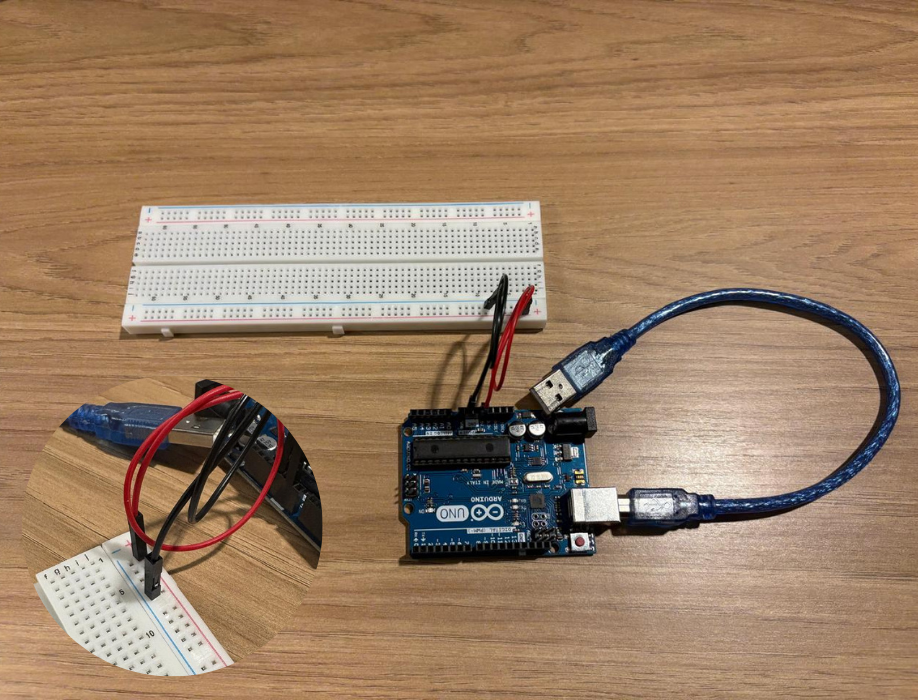
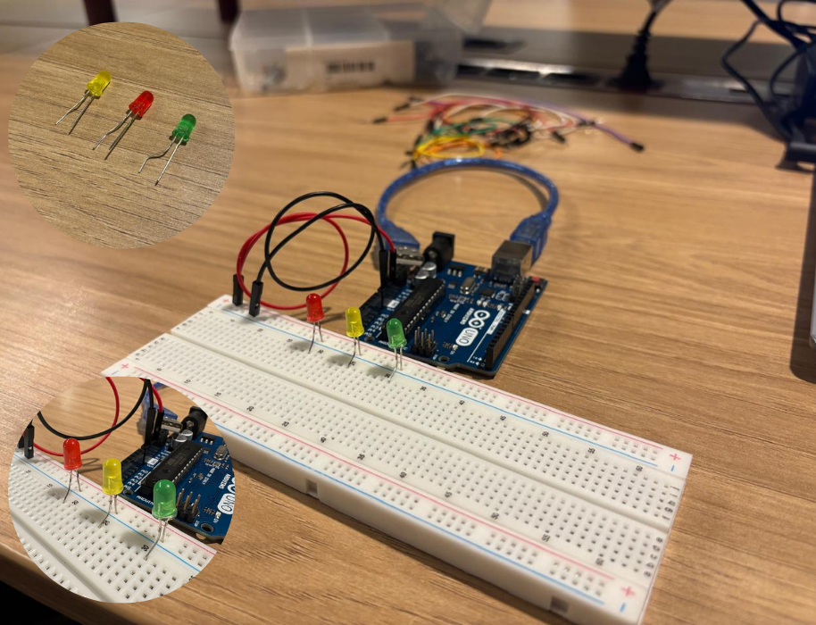
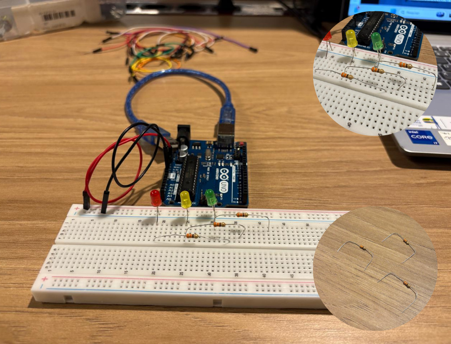
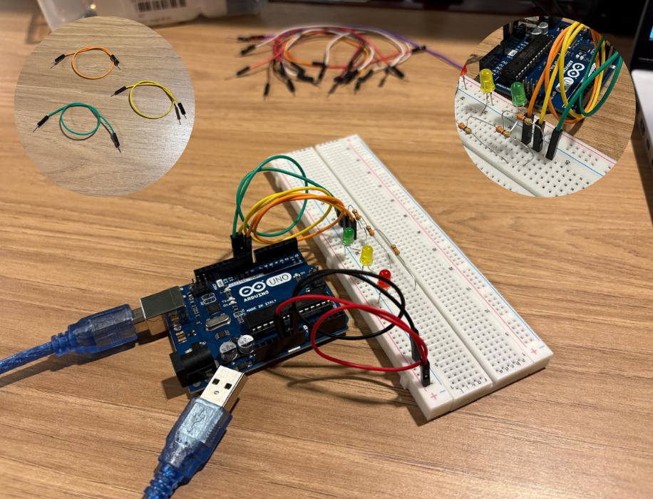
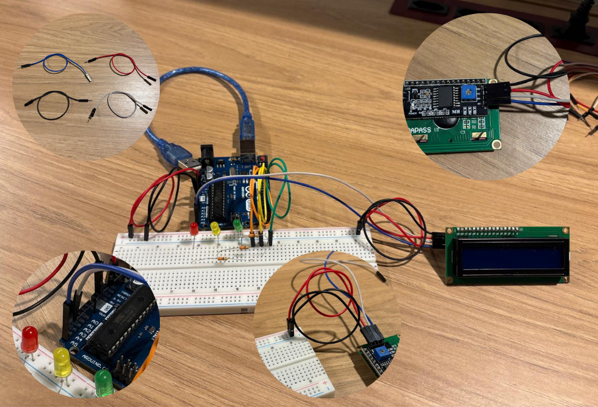

# Semáforo com Arduino

## Descrição do Projeto
Este projeto tem como objetivo criar um **sistema de semáforo automatizado** utilizando **Arduino UNO**, **LEDs** e **resistores**, simulando o funcionamento de um cruzamento real.  
O sistema alterna automaticamente entre as três fases do semáforo, garantindo a segurança de pedestres e veículos:

- 🔴 **Vermelho:** 6 segundos  
- 🟢 **Verde:** 4 segundos  
- 🟡 **Amarelo:** 2 segundos  

Além disso, **foi implementado um recurso extra opcional**: um **display LCD I2C 16x2** que exibe dinamicamente o **tempo restante de cada fase**.  

---

## Componentes Utilizados

| Componente | Quantidade | Especificação / Observação |
|-------------|-------------|-----------------------------|
| LED vermelho | 1 | Representa o sinal de **Pare** |
| LED amarelo | 1 | Representa o sinal de **Atenção** |
| LED verde | 1 | Representa o sinal de **Siga** |
| Resistores | 3 | 220 Ω — um para cada LED |
| Display I2C 16x2 | 1 | **Extra:** para mostrar contagem regressiva |
| Protoboard | 1 | Padrão 830 pontos |
| Fios jumper | 5 | Macho–macho |
| Fios jumper | 4 | Macho–fêmea |
| Arduino UNO | 1 | Microcontrolador principal |
| Cabo USB | 1 | Alimentação e upload do código |

---

## Esquema de Ligação

### Conexões dos LEDs
| LED | Pino Arduino | Ligação |
|------|----------------|----------|
| Vermelho | + resistor → 8 | GND |
| Amarelo | + resistor → 9 | GND |
| Verde | + resistor → 10 | GND |

### Conexões do Display LCD I2C (extra)
| Pino do LCD | Pino do Arduino | Função |
|--------------|----------------|----------|
| VCC | 5V | Alimentação |
| GND | GND | Terra |
| SDA | A4 | Comunicação de dados |
| SCL | A5 | Clock do barramento I2C |

---

## Código Fonte (Arduino IDE)

```cpp
#include <Wire.h>
#include <LiquidCrystal_I2C.h>

// Define os pinos dos LEDs
#define LED_RED 8
#define LED_YELLOW 9
#define LED_GREEN 10

// Configura o display I2C
LiquidCrystal_I2C lcd(0x27, 16, 2);

void setup() {
  // Configuração dos LEDs
  pinMode(LED_RED, OUTPUT);
  pinMode(LED_YELLOW, OUTPUT);
  pinMode(LED_GREEN, OUTPUT);

  // Inicialização do display LCD
  lcd.init();
  lcd.backlight();
  lcd.clear();
  lcd.setCursor(0, 0);
  lcd.print("  SEMAFORO V1.0");
  lcd.setCursor(0, 1);
  lcd.print("Iniciando...");
  delay(2000);
  lcd.clear();
}

void loop() {
  // Fase Vermelha (6s)
  digitalWrite(LED_RED, HIGH);
  digitalWrite(LED_YELLOW, LOW);
  digitalWrite(LED_GREEN, LOW);
  mostrarContagem("Vermelho", 6);

  // Fase Verde (4s)
  digitalWrite(LED_RED, LOW);
  digitalWrite(LED_YELLOW, LOW);
  digitalWrite(LED_GREEN, HIGH);
  mostrarContagem("Verde", 4);

  // Fase Amarela (2s)
  digitalWrite(LED_RED, LOW);
  digitalWrite(LED_YELLOW, HIGH);
  digitalWrite(LED_GREEN, LOW);
  mostrarContagem("Amarelo", 2);
}

// Função auxiliar: exibe contagem no LCD
void mostrarContagem(String cor, int tempo) {
  for (int i = tempo; i > 0; i--) {
    lcd.clear();
    lcd.setCursor(0, 0);
    lcd.print("Sinal: " + cor);
    lcd.setCursor(0, 1);
    lcd.print("Tempo: " + String(i) + "s");
    delay(1000);
  }
}
```

## Tutorial de Montagem

### 1° Passo - Conexão Inicial
<div align="center">
<sub>Figura 1 - Requisitos iniciais</sub>
<br>

<br>
<br>
</div>

Neste primeiro momento, reúna os materiais principais: uma protoboard, um Arduino UNO e um cabo USB.

Conecte o Arduino ao computador usando o cabo USB, que servirá tanto para alimentar o circuito quanto para enviar o código a partir da IDE Arduino.

A protoboard será utilizada como base para todas as conexões, permitindo montar o circuito sem soldas.

### 2° Passo - Alimentação da Protoboard
<div align="center">
<sub>Figura 2 - Primeiras ligações</sub>
<br>

<br>
<br>
</div>

Conecte o pino 5V do Arduino à coluna positiva (+) da protoboard utilizando um jumper vermelho e essa coluna distribuirá a tensão positiva para os componentes.

Depois, ligue o pino GND do Arduino à coluna negativa (–) da protoboard com um jumper preto, criando o caminho de retorno da corrente elétrica.

Essas duas colunas (5V e GND) funcionarão como “barramentos de energia” do seu circuito.

### 3° Passo
<div align="center">
<sub>Figura 3 - Implantação dos LEDs</sub>
<br>

<br>
<br>
</div>

Serão utilizados três LEDs: vermelho, amarelo e verde, representando as fases do semáforo.
Coloque cada LED em linhas separadas da protoboard, respeitando a polaridade:
- **A perna menor (catodo) de cada LED deve estar ligada na coluna GND (linha negativa).**
- A perna maior (anodo) ficará livre, pois será conectada a um resistor no próximo passo.
Mantenha os LEDs organizados na ordem: vermelho, amarelo e verde, para facilitar a visualização da sequência.

### 4° Passo
<div align="center">
<sub>Figura 4 - Implantação dos resistores</sub>
<br>

<br>
<br>
</div>

Adicione três resistores de 330 Ω, um para cada LED.

**Cada resistor deve ser conectado entre a perna maior (anodo)** do LED e uma linha livre da protoboard, onde depois será ligado o fio de controle do Arduino.
Esses resistores são essenciais para limitar a corrente que passa pelos LEDs, evitando que queimem ao serem energizados.

### 5° Passo
<div align="center">
<sub>Figura 5 - Implantação dos jumpers</sub>
<br>

<br>
<br>
</div>

Conecte os jumpers de sinal, que vão controlar o acendimento dos LEDs:

- **Jumper laranja (porta 8)**: conectar na linha do resistor do LED vermelho.

- **Jumper amarelo (porta 9)**: conectar na linha do resistor do LED amarelo.

- **Jumper verde (porta 10)**: conectar na linha do resistor do LED verde.

Esses fios ligam as saídas digitais do Arduino aos LEDs, permitindo que o código acione cada cor conforme o tempo programado no sketch.

### 6° Passo
<div align="center">
<sub>Figura 6 - Extra: Display</sub>
<br>

<br>
<br>
</div>

Para complementar o projeto, conecte o display LCD 16x2 com módulo I2C, que mostrará o tempo de cada fase do semáforo:

- **GND** do display → **coluna negativa (–)** da protoboard com **jumper preto**

- **VCC** do display → **coluna positiva (+)** da protoboard com **jumper vermelho**

- **SDA** → pino **A4** do Arduino com **jumper branco**

- **SCL** → pino **A5** do Arduino com **jumper azul**

Essas conexões permitem a comunicação entre o Arduino e o display com apenas dois fios de dados.

---
## Vídeo de Demonstração
[Clique AQUI](https://drive.google.com/file/d/1In0ACiZk_tQ2dKcayyV4njXACwC2q1oC/view?usp=sharing)
